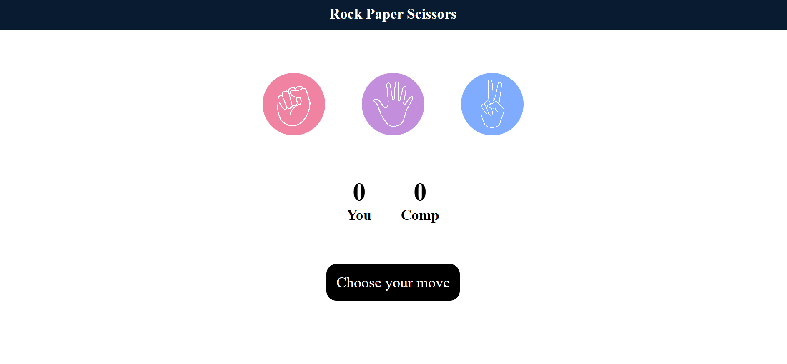
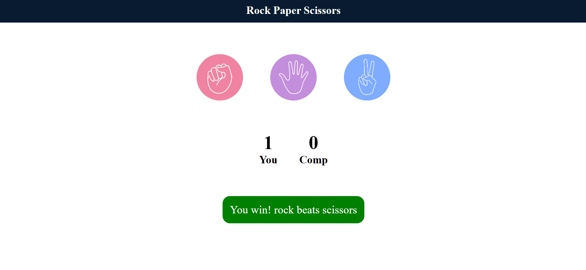
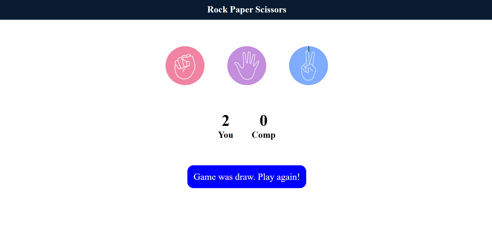
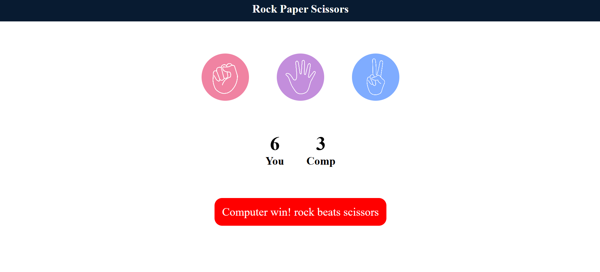

# rock-paper-scissors-game

An interactive Rock Paper Scissors game built using HTML, CSS and JavaScript.

## Preview

## Features

- Interactive Rock, Paper and Scissors choices
- Computer-generated random choice
- Automatic win, lose and draw detection
- Score tracking
- Interactive game feedback

## Technologies Used

- HTML5
- CSS3
- JavaScript

## How to Run

1. Clone the repository.
2. Open the project folder.
3. Open `index.html` in your browser.

## Purpose

This project was created to practice JavaScript game logic,
DOM manipulation, event handling and user interaction.